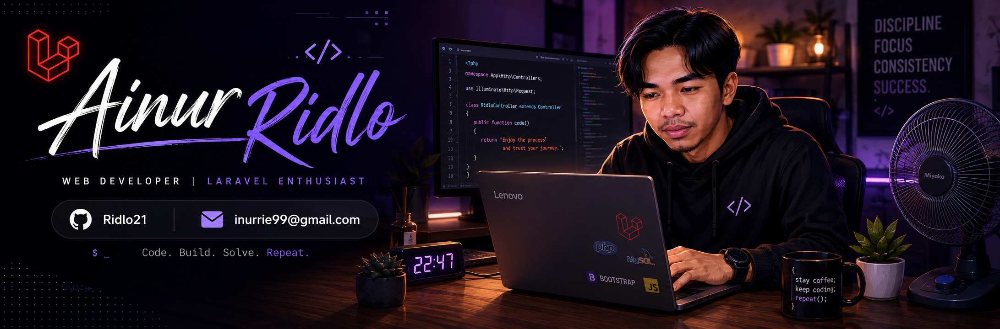

<!--
**Ridlo21/ridlo21** is a ✨ _special_ ✨ repository because its `README.md` (this file) appears on your GitHub profile.

Here are some ideas to get you started:

- 🔭 I’m currently working on ...
- 🌱 I’m currently learning ...
- 👯 I’m looking to collaborate on ...
- 🤔 I’m looking for help with ...
- 💬 Ask me about ...
- 📫 How to reach me: ...
- 😄 Pronouns: ...
- ⚡ Fun fact: ...
-->

<!-- 
A passionate web developer from Indonesia, specializing in Laravel and modern web applications.

- 🔭 I’m currently working on educational and management web applications using Laravel.
- 🌱 I’m currently learning software architecture, UI/UX design, and interactive web application development.
- 👯 I’m looking to collaborate on open-source and web development projects.
- 🤔 I’m looking for help with building better user experiences and scalable applications.
- 💬 Ask me about Laravel, PHP, MySQL, Bootstrap, and web development.
- 📫 How to reach me: Open an issue or start a discussion on GitHub.
- 😄 Pronouns: He/Him
- ⚡ Fun fact: I enjoy spending quiet evenings coding with a fan running beside me.

##### Skills

##### Connect with me

   

##### My github stats

 -->

#### Hello, I'm Ainur Ridlo, S.Kom. 👋

##### 🌐 Socials:
   

##### 💻 Tech Stack:
         
##### 📊 GitHub Stats:
 
 

##### ✍️ Dev Quote

<h4 data-importer="text" align="left">Play games with me</h4>

###

###

<picture data-importer="pacman">
  <source media="(prefers-color-scheme: dark)" srcset="https://raw.githubusercontent.com/ridlo21/ridlo21/pacman-output/pacman-contribution-graph-dark.svg?game=pacman">
  <source media="(prefers-color-scheme: light)" srcset="https://raw.githubusercontent.com/ridlo21/ridlo21/pacman-output/pacman-contribution-graph.svg?game=pacman">
  
</picture>

###